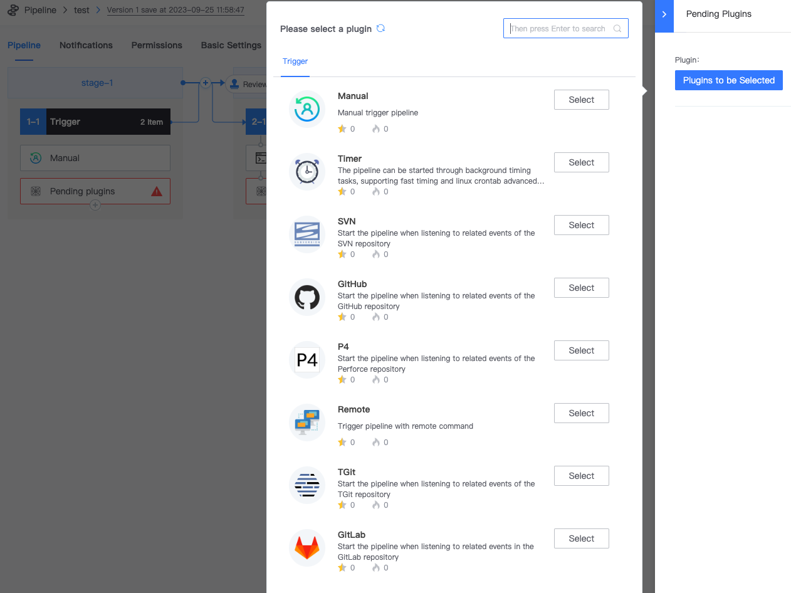

 # Triggers 

 ## General triggerType 
 BK-CI supports multiple ways to trigger Pipeline: 

 - API trigger 
 - Code Repository event triggering 
 - subPipeline call Plugin trigger 
 - Scheduled triggers 
 - Manual triggers 
 - Remote triggers 

 system built-in BK_CI_START_TYPE Access varies with different triggerType. You can use The value in subsequent Plugin of Pipeline as needed: 

 triggerType| BK_CI_START_TYPE value 
 --- | --- 
 Remote triggers| REMOTE 
 Manual triggers| MANUAL 
 Scheduled triggers| TIME_TRIGGER 
 Pipeline Plugin trigger| PIPELINE 
 Code Repository HOOK trigger| WEB_HOOK 
 API trigger| SERVICE 

  

 ## Triggering GitHub event 

 If you need GitHub event triggering, you need to apply One additional [GitHub APP](https://docs.github.com/en/developers/apps/getting-started-with-apps/about-apps) when Deploy BK-CI. 

 ```text 
 You need to fill the following corresponding var into the bkenv.properties setting file, and then Generate configuration file with render_tpl 
 ``` 

 [](https://user-images.githubusercontent.com/16686129/99356538-47abdf00-28e5-11eb-9c25-bc000ff719da.png)  
 [](https://user-images.githubusercontent.com/16686129/99356232-cce2c400-28e4-11eb-88bf-44e60505abbd.png) 