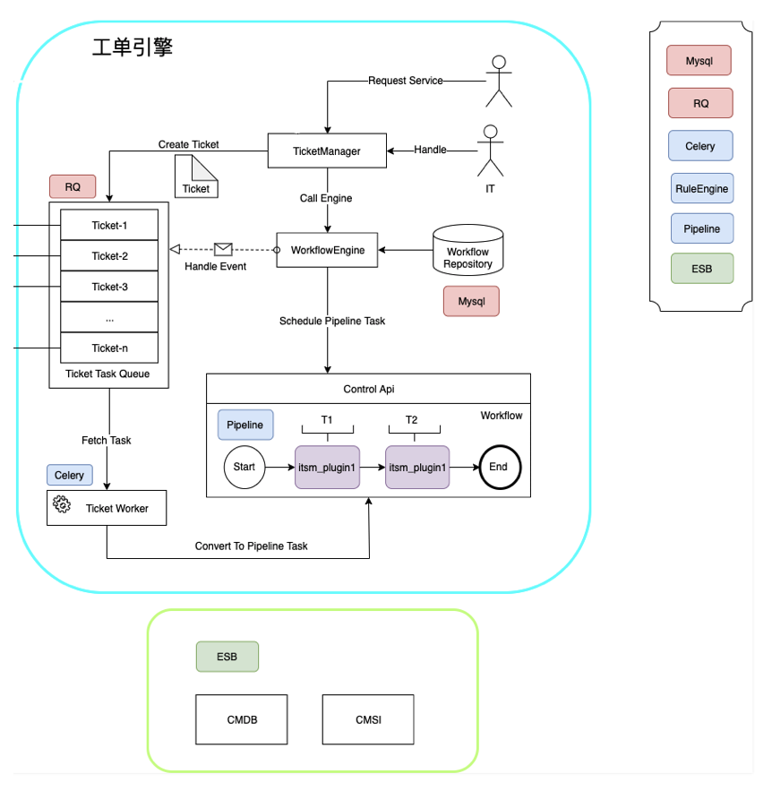
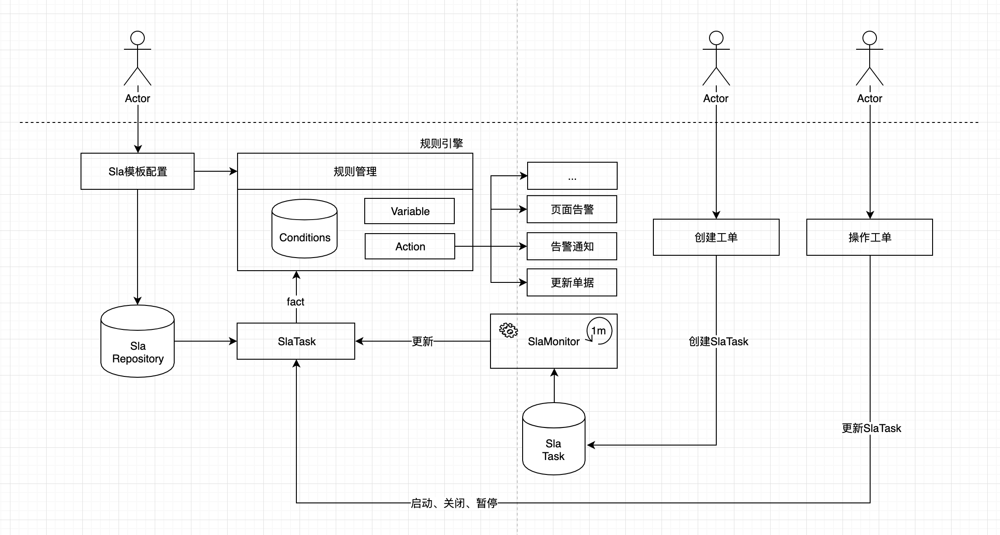
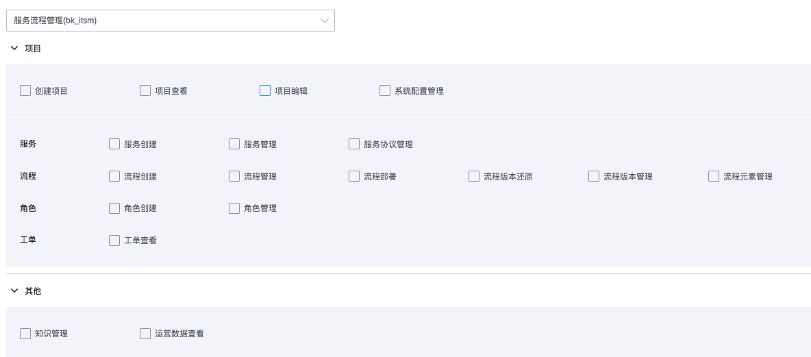
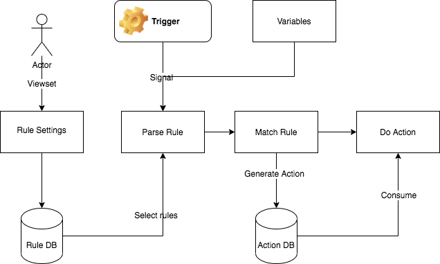

 # Ticket Flow Engine system 

  

 # SLA Engine system 
  

 # Backend auth control system 
 The auth model of the system has been connected to the accessCenter Version 3.0. Users can Application for the following permissions according to their own needs, or group permissions approve Set userGroup. 
  

 # Triggers system 

  