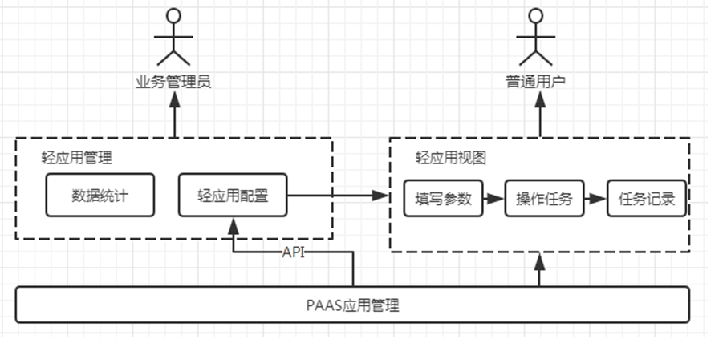

 # Mini-App system structure and function 

 A Mini-App is One Application create approve the API provided by BlueKing PaaS, and can be search in the Market, append to the user's desktop, opened for Operation, etc. like Normal APP application. 

 Mini-App is One relatively independent Module of Standard OPS, which is mainly divided into 2 parts. 

 - Mini-App Manage terminal 

 The Mini-App Manage terminal is inside the Standard OPS product, and its main function is to provided the light Serving Config Module for the Business Name Administrator to Operation, so as to Created, Revise or Delete the light application. 

 The Serving Config is Operation approve the API provided by PaaS, so that user can see the light application create by the Business Name Administrator on the PaaS desktop. 

 The Statistics Module can count the Count and Service Classification of Mini-App create by each Business Name, and provided DataView for the Administrator to Check. 

 - Mini-App view 

 Mini-App view is an independent function of each light application. Although the front-end and bottom layer are provided by Standard OPS products, Normal user open it as if they are Operation One independent APP. 

 User can Fill In the Task Parameter in the Mini-App, execute tasks, and View all the Tasks. 

  