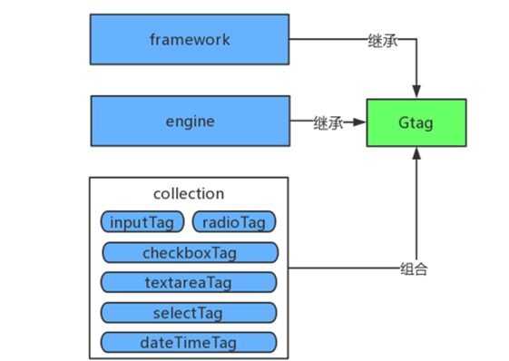

 # Standard Plugin system structure and function 

 A few important concepts: 

 - **framework**： The basic structure of the Standard Plugin front-end preset by the system. all standard plug-ins are designed according to this structure. 
 - **engine**: The Parameter assembly and var Replace engine of Standard Plugin, and is responsible for Transformer the execute parameters of standard plug-ins into the format displayed by the front-end. 
 - **collection**： Parameter Collection, the minimum Unit of Standard Plugin, such as enum, multi-selection box, Input box, etc. Each standard plug-in is composed of One or more Parameters. 

 The core design idea of a Standard OPS product is to split the OPS Operation Scene into independent Standard Plugin Components, and then provided an interactive interface to facilitate the organization and Manage of these standard plug-in components, and organize these standard plug-in components into the operation Flow of each OPS scenario. 

 The Parameter collection part of the Standard Plugin Components mentioned here is called gTags in the Standard OPS, and is responsible for displaying the parameter input and display of the standard plug-in component. 

 The Standard Plugin Components is very similar to the form form in the front end. In fact, the implementation idea of the standard plug-in component (gTags) is the form form, but there are still some differences. The main differences between the standard plug-in component and the form form are as follows: 

 (1)Each Input item in the Standard Plugin Components can be checked, and the checked Parameter can be Fill In in the Task create page; 

 (2)The Input items in Standard Plugin Components are not Normal form input items, but some are complex plug-ins, such as drop-down boxes with Search function or autocomplete. Currently, Standard OPS mainly uses kendo framework definition plug-ins for front-end input, and user can also setting their own bootstrap plug-ins. 

 (3)The Check rules of Input items in Standard Plugin Components are different. The checked input items will not be verified, and the input items containing var references will not be verified. Other situations are the same as the verification of Normal form fields; 

 (4)The Standard Plugin Components Module is also responsible for Generate the final execution plan that can be directly used by the execute module according to the Parameter Input by the front-end page, and displaying the execution plan. 

  