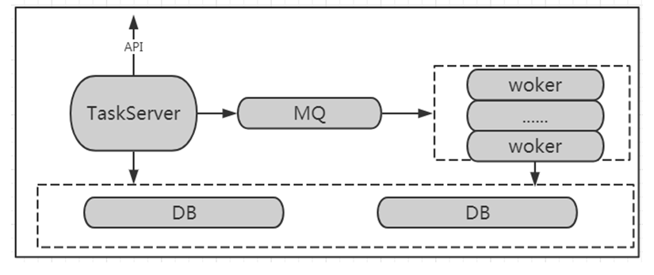

 # Checks Engine system Structure and Function 

 Responsible for maintaining the Task Queue, distributing it to the walker for execute according to the priority, and Update the Task Total to the Database persistent Storage Real time. 

 TaskServer is responsible for analyzing the Task execute plan of the upper layer and putting the tasks to be executed into the Message queue MQ. 

 TaskServer is also responsible for provided external APIs, so that upper-layer Apply can Operation Task approve APIs, such as Start, PAUSE tasks, restore tasks, terminate tasks, etc., and Real time rotation training task execute Status through APIs, as well as obtaining important information such as task executionTime and log. 

 MQ Queue use RabbitMQ to receive Task sent by TaskServer and assign them to idle workers according to Priority. 

 The Worker uses python's celery package and is responsible for execute a specific Task in the background of Apply. 

 Worker is also responsible for writing the execute result of the Task to the Database DB, which can persistently Storage Task information and enable TaskServer to Query the database record of the task to obtain the task information. 

  