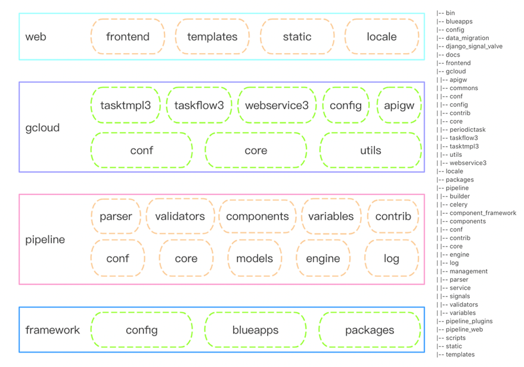

# Installation package

- document

bk_sops_Vx.x.x-ee.tar.gz

- File directory structure and function description

The code can be mainly divided into the BlueKing development framework layer framework, the process engine service layer pipeline, the standard operation and maintenance business layer gcloud, and the front-end display layer web.

- framework

   Based on the secondary packaging architecture of the django framework, BlueKing mainly provides basic configuration and services for SaaS operations on BlueKing PaaS.

   config: The configuration of each deployment environment of the project, such as the local environment, test environment, formal environment, and routing configuration.

   blueapps: The core module of the new development framework, including BlueKing unified login, authentication, middleware and public functions.

   packages: BlueKing API Gateway SDK, including APIs provided by the configuration platform and operation platform.

- pipeline, pipeline_web, pipeline_plugins

   Self-developed process engine framework, mainly including task process layout page and task process execution service

   conf: default configuration

   core: Referring to the BPMN2.0 specification, it defines some core elements such as Activity, gateway, event and data object Data, as well as the overall structure of the pipeline

   models: storage structure definition and related methods

   engine: runtime execution logic and task state management

   log: log persistent storage and management

   parser: front-end data structure analysis

   validators: data verification, such as ring structure detection and data legality verification

   component_framework: plugin framework and plugin definition

   variables: global variable definition

   contrib: extended functions, such as data statistics and front-end API

   pipeline_web: the front-end data adaptation layer, which supports the process data generated by the front-end canvas

   pipeline_plugins: standard operation and maintenance official plug-in library and global custom variables

- gcloud

   The business adaptation layer encapsulated based on the process engine framework includes functions such as business authority control, process template management, task management, business configuration, and API.

   conf: configure the dynamic adaptation layer

   core: business core logic, authority control, business home page

   utils: public functions and modules

   tasktmpl3: process template management

   taskflow3: task management

   webservice3: data resource API management

   config: business configuration

   apigw: external API module

- web

   Front-end resources, including webpack configuration and static resources.

   frontend: mainly includes the process arrangement desktop module, which is implemented based on vue

   static: The front-end definition files of plug-in components and variables are placed in the static directory of their respective modules

   templates: Contains the home page and the pages required by django admin

   locale: Internationalization translation file